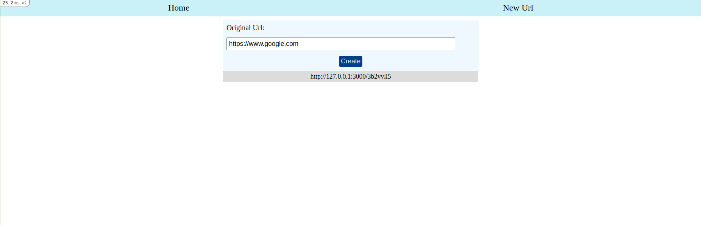
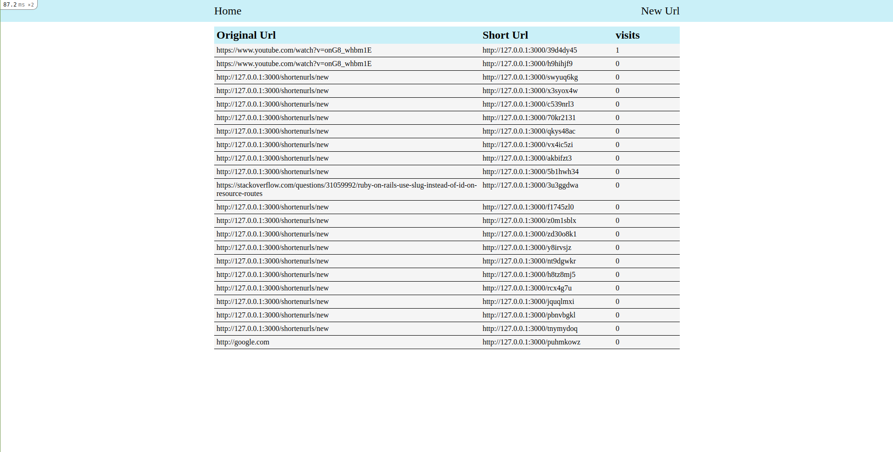

# Shorten Url

this repo is a Ruby on Rails application that allows users to create short URLs for their long ones to make it easier to save them.

## Built With

- Ruby 2.6.5
- Rails 6.1.3
- Stimulus
- Rspec
- Capybara
- Html5
- Sass
- Shoulda Matchers

## Screenshot





## Getting Started

To get a local copy up and running follow these simple example steps.

### Prerequisites

- Ruby 2.6.5
- Rails 6.1.3

[Chromdriver](https://github.com/SeleniumHQ/selenium/wiki/ChromeDriver)

### Clone the Project

```
$ git clone https://github.com/rida-elbahtouri/Chunin-Exam.git

$ cd Chunin-Exam
```

### Setup

Instal gems with:

```
bundle install
```

Setup database with:

```
   rails db:migrate
```

### Usage

Start server with:

```
    rails server
```

Open `http://localhost:3000/` in your browser.

Click on new Url from nav to create Short Url

click Home to see list of all Urls

# Testing

To run the testing, you need to have ChromeDriver installed in your environment.
Run one of this commands respected to your system:

```
Mac users with Homebrew installed: brew tap homebrew/cask && brew cask install chromedriver
Debian based Linux distros: sudo apt-get install chromium-chromedriver
Windows users with Chocolatey installed: choco install chromedriver

```

Now you can run the testing using this command:

```
rspec

```

## Developer

👤 **Rida Elbahtouri**

- [Github](https://github.com/rida-elbahtouri)
- [Twitter](https://twitter.com/RElbahtouri)
- [Linkedin](https://www.linkedin.com/in/rida-elbahtouri/)
